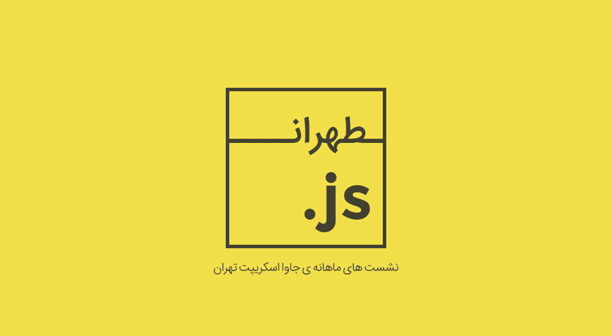

# Tehran.js Proposal (website)



[](http://forthebadge.com)

This landing page was my proposal for tehran.js website that it wasn't used

#How to use

**First**, Clone this repo

**Second**, Cd to projects's folder

**Next**, Install its dependencies by this command 
``` [sudo] npm install```

**Finally**, After , dependencies were installed

1. For Serve Project : ```npm start``` 

> After this command you should see a new tab in your browser.

2. For Deploy Project : ```npm run build```

> After this command you should see a new folder that name is build in root project .

#Font of project

Originally, [Iran Sans](http://fontiran.com/%D8%AE%D8%A7%D9%86%D9%88%D8%A7%D8%AF%D9%87-%D9%81%D9%88%D9%86%D8%AA-%D8%A7%DB%8C%D8%B1%D8%A7%D9%86-%D8%B3%D9%86-%D8%B3%D8%B1%DB%8C%D9%81-iran-sans-%D9%BE%D9%86%D8%AC-%D9%88%D8%B2%D9%86-%D9%87%D9%85/) has been used for this project that created by **Moslem Ebrahimi** ,but it doesn't exist in this repo because you know 😄
> So if you've already bought this font locate it in ```dev/font/irsans``` folder

**Or**

buy it from [Font Iran](http://fontiran.com/%D8%AE%D8%A7%D9%86%D9%88%D8%A7%D8%AF%D9%87-%D9%81%D9%88%D9%86%D8%AA-%D8%A7%DB%8C%D8%B1%D8%A7%D9%86-%D8%B3%D9%86-%D8%B3%D8%B1%DB%8C%D9%81-iran-sans-%D9%BE%D9%86%D8%AC-%D9%88%D8%B2%D9%86-%D9%87%D9%85/) 

# What is Tehran.js
Tehran.js is a Voluntary organizations for holding monthly meeting about **java script** and the newest technology about it.

* [Twitter](https://twitter.com/TehranJs)
* [Telegram Group](https://telegram.me/joinchat/AiISmTuurkvbi1ZVKNFtpA)
* [Evand Page](https://evand.ir/organizations/tehranjs)
